# Fluxo Jira agêntico com Human-in-the-Loop

## Finalidade e escopo

Este é o documento canônico do fluxo de uma demanda Jira processada pelo Open
SWE, com OpenSpec, GitHub e três decisões humanas. Ele descreve o comportamento
implementado: um **único deep agent** retomado por fase, um **reviewer graph**
separado para a revisão da Pull Request (PR), e papéis lógicos escolhidos pela
coluna em que o poller retoma o card.

O documento também separa:

- **autoria e avaliação por LLM**, que exigem julgamento ou leitura de contexto;
- **checks mecânicos**, que verificam estrutura, comandos, estados ou existência
  de recursos;
- **decisões humanas**, que não podem ser substituídas por uma resposta de
  agente.

O diagrama e as tabelas abaixo prevalecem sobre descrições históricas da change
OpenSpec que tenham sido substituídas. Em particular, archive e documentação
entram na mesma branch e na mesma PR da implementação, antes de `Em Merge`; não
existe uma PR de documentação pós-merge.

---

## Vocabulário: estado, fase, graph e papel

Esses termos não são intercambiáveis:

| Termo | Significado neste fluxo |
|---|---|
| **Estado/status** | Nome Jira usado na API, no JQL e na transição do card. Os 11 status do board são listados na seção seguinte. |
| **Coluna** | Rótulo visual que a pessoa lê no board. Hoje os nomes do board coincidem em grande parte com os status, mas a API e o rótulo são conceitos distintos. |
| **Fase/segmento** | Trabalho feito entre duas decisões ou entre um retorno e o próximo gate. Não é um graph separado. |
| **Graph** | Topologia executável do LangGraph. O workflow Jira usa o graph principal `agent` e chama o graph `reviewer` quando existe uma PR. |
| **Papel** | Rota lógica (`AgentRole`) usada para escolher modelo, esforço e metadados da execução. O papel é derivado da coluna de retomada; não é um nó nem um agente independente. |
| **Run** | Uma execução do graph. Cada gate encerra o run; o poller cria outro run na mesma thread depois da decisão humana. |
| **Thread** | Identificador durável e determinístico derivado da chave do Jira. É a continuidade da demanda entre os runs. |

Portanto, o fluxo **não** tem 11 agentes, nem um graph para cada etapa:

```text
card Jira → thread determinística → vários runs do graph agent
                                      ├─ papel escolhido pela coluna
                                      └─ reviewer graph separado para a PR
```

---

## Os 11 estados do board

Estes são os 11 status configuráveis do projeto. Os valores abaixo são os
defaults atuais do projeto SSAI e são também os nomes enviados à API Jira. Se
uma implantação sobrescrever `JIRA_COLUMN_*`, o nome efetivo do ambiente deve
ser usado nos comentários, no JQL e nas transições.

| # | Status/coluna | Quem move o card para este estado | Papel do estado |
|---:|---|---|---|
| 1 | `BACKLOG` | Pessoa ou integração | Gatilho; inicia a autoria da spec. O card permanece aqui durante toda a fase de spec. |
| 2 | `In Progress` | Agente | Implementação em andamento. Só entra aqui ao retomar de `Spec Aprovada`. |
| 3 | `Em Revisão de Spec` | Agente, como estacionamento | Gate 1; OpenSpec publicada e aguardando decisão humana. |
| 4 | `Spec Aprovada` | Pessoa | Decisão positiva do Gate 1; autoriza a implementação. |
| 5 | `Ajustar Spec` | Pessoa | Decisão de retorno do Gate 1; exige revisão da OpenSpec. |
| 6 | `Em Code Review` | Agente, como estacionamento | Gate 2; código, checks, PR e reviewer graph concluídos sem bloqueio. |
| 7 | `Code Review Aprovado` | Pessoa | Decisão positiva do Gate 2; autoriza a preparação para merge. |
| 8 | `Ajustar Code` | Pessoa | Decisão de retorno do Gate 2; exige correções na mesma branch e PR. |
| 9 | `Em Merge` | Agente, como estacionamento | Gate 3; toda a automação terminou e a PR está pronta para merge humano. |
| 10 | `Mergeado` | Pessoa | O merge ocorreu no GitHub; o agente apenas confirma e encerra. |
| 11 | `Done` | Agente | Estado terminal administrativo, após confirmação do merge. |

O board permite transições globais. Isso torna possíveis os retornos de
ajuste sem criar uma matriz de transições específica, mas não muda a
responsabilidade: o agente só faz uma transição depois de concluir o trabalho
correspondente, e a pessoa continua dona das três decisões.

---

## Diagrama ponta a ponta

O `T(SSAI-XXXX)` indicado no diagrama é a mesma thread determinística em todos
os segmentos. Cada caixa de retomada representa um novo run do mesmo graph
principal, não um novo agente.

```mermaid
flowchart LR
  subgraph H["HUMANO"]
    H0["Cria ou registra o card"]
    H1{"GATE 1<br/>Revisa a OpenSpec"}
    H2{"GATE 2<br/>Revisa a PR e o código"}
    H3{"GATE 3<br/>Decide sobre o merge"}
    H0a["Spec Aprovada"]
    H0b["Ajustar Spec"]
    H1a["Code Review Aprovado"]
    H1b["Ajustar Code"]
    H2a["Merge no GitHub<br/>e move para Mergeado"]
    H2b["Não mergeia:<br/>card permanece Em Merge"]
  end

  subgraph JP["JIRA / POLLER"]
    J0["Card em BACKLOG"]
    P0["Tick do scheduler/poller<br/>consulta Jira"]
    P1["Cria ou encontra T(issue key)<br/>e dispara o run"]
    G1["Estaciona em<br/>Em Revisão de Spec"]
    R1a["Detecta mudança:<br/>Spec Aprovada"]
    R1b["Detecta mudança:<br/>Ajustar Spec"]
    G2["Estaciona em<br/>Em Code Review"]
    R2a["Detecta mudança:<br/>Code Review Aprovado"]
    R2b["Detecta mudança:<br/>Ajustar Code"]
    G3["Estaciona em<br/>Em Merge"]
    R3["Detecta Mergeado<br/>e retoma T"]
    JD["Move para Done<br/>após confirmação"]
    JM["Card em Mergeado"]
  end

  subgraph A["AGENTE PRINCIPAL — graph agent / deep agent"]
    A0["Coleta contexto Jira<br/>e prepara sandbox"]
    A1["Analisa código e escreve<br/>OpenSpec em BACKLOG"]
    A2["Auto-review da spec<br/>e checks de artefato"]
    A3["Retoma: ajusta spec<br/>na mesma branch"]
    A4["Retoma: move para In Progress<br/>e implementa"]
    A5["Testa, faz self-review,<br/>commit/push e abre/atualiza PR"]
    A6["Retoma: lê findings GitHub,<br/>corrige e atualiza a mesma PR"]
    A7["Retoma: checks finais,<br/>archive OpenSpec e docs"]
    A8["Retoma: confirma merge,<br/>comenta e fecha administrativamente"]
  end

  subgraph RV["REVIEWER GRAPH — separado"]
    V0["Recebe URL de uma PR real"]
    V1{"Resultado da revisão"}
    V2["PASS sem finding bloqueante"]
    V3["CHANGES_REQUIRED<br/>ou finding bloqueante"]
  end

  subgraph GH["GITHUB"]
    GH0["Branch feat/spec-JIRA-XXXX-*"]
    GH1["Mesma PR durante todo o ciclo"]
    GH2["Pessoa faz o merge"]
    GH3["API confirma state=merged"]
  end

  H0 --> J0 --> P0 --> P1 --> A0 --> A1 --> A2 --> G1
  A1 -. "OpenSpec commitada e pushed" .-> GH0
  G1 -. "run encerra; thread parked" .-> H1
  H1 --> H0a --> R1a --> A4
  H1 --> H0b --> R1b --> A3
  A3 --> A2
  A4 --> A5
  A5 --> GH1
  A5 --> V0
  V0 --> V1
  V1 --> V2 --> G2
  V1 --> V3 --> A6 --> A5
  G2 -. "run encerra; thread parked" .-> H2
  H2 --> H1a --> R2a --> A7
  H2 --> H1b --> R2b --> A6
  A7 --> G3
  A7 -. "archive + docs no mesmo PR" .-> GH1
  G3 -. "run encerra; thread parked" .-> H3
  H3 --> H2a --> GH2 --> JM
  H3 --> H2b
  JM --> GH3 --> R3 --> A8 --> JD
```



### Leitura do diagrama

1. O poller observa o Jira; ele não contém uma LLM e não espera dentro do run.
2. O agente trabalha até o próximo gate, comenta no card, estaciona-o e encerra
   o run. `jira_park_at_gate` faz o comentário, a transição e marca a thread
   como estacionada.
3. O poller consulta tanto os gates quanto os status para os quais a pessoa
   pode mover o card. Ele só retoma quando o status atual é diferente do status
   armazenado em `jira_parked_column`.
4. `Ajustar Spec` volta à autoavaliação da spec. `Ajustar Code` volta à leitura
   de findings e à implementação. Ambos usam a mesma branch e a mesma PR.
5. O reviewer graph é chamado somente com uma PR real. `PASS` leva ao Gate 2;
   `CHANGES_REQUIRED` volta à implementação e não é estacionado como aprovação.
6. O merge e a mudança para `Mergeado` são ações humanas. A fase
   `Mergeado → Done` não altera código, branch, archive ou documentação.

---

## Segmentos de execução e os PASSOS operacionais

Os 11 itens anteriores são estados do board. Os passos abaixo são o que o
agente efetivamente faz entre eles.

### Segmento A — `BACKLOG` até `Em Revisão de Spec`

1. **Coletar contexto:** ler descrição completa, critérios de aceitação,
   comentários, logs, tracebacks e evidências do Jira. O card é a fonte de
   intenção; o repositório é a fonte do comportamento atual.
2. **Preparar o ambiente:** clonar ou reutilizar somente o repositório alvo,
   conferir `.git` e `origin`, carregar instruções e criar a branch
   `feat/spec-<JIRA_KEY>-<descricao-curta>`. Commits, pushes e PRs nunca vão
   para o repositório que hospeda o agente.
3. **Executar o Harness Engineer quando aplicável:** em repositório Python,
   detectar versão, instalação, teste, lint, type-check, migração e variáveis
   necessárias. O relatório fica fora do clone. Se não for possível determinar
   um comando de teste seguro, o run estaciona operacionalmente com a
   explicação; não adivinha um comando.
4. **Analisar e escrever a OpenSpec:** gerar `proposal.md`, `design.md` quando
   necessário, `specs/<capability>/spec.md` e `tasks.md`. Cada requisito deve
   rastrear uma fonte e cada cenário deve ser verificável.
5. **Fazer auto-review da spec:** aplicar a matriz de validação por LLM e os
   checks mecânicos de estrutura.
6. **Publicar e estacionar:** commitar os artefatos, fazer push, confirmar a
   existência da branch remota e só então chamar `jira_park_at_gate` para
   `Em Revisão de Spec`. O card ainda não passa por `In Progress`.

### Segmento B — retomada por `Spec Aprovada`

Ao encontrar `Spec Aprovada`, o poller retoma a mesma thread. O agente confirma a
OpenSpec e a branch existentes, move o card para `In Progress` e implementa as
tarefas. `In Progress` marca o começo da implementação, não da especificação.

O agente executa testes e validações aplicáveis, faz commit e push e garante que
existe uma PR. A PR pode ser draft, mas deve existir antes do reviewer graph.

### Segmento C — implementação, self-review e `Em Code Review`

O agente faz o auto-review do código. Em seguida chama o reviewer graph com a
URL da mesma PR.

- `PASS` sem findings bloqueantes: o agente comenta o resultado e estaciona em
  `Em Code Review`.
- `CHANGES_REQUIRED` ou finding bloqueante: o agente retorna à implementação,
  resolve os findings, atualiza a PR e solicita uma nova revisão.

Para entrar no gate, implementação, testes, self-review, `openspec-verify` e
PR devem estar em estado satisfatório. O agente não move o card para
`Code Review Aprovado`.

### Segmento D — retomada por `Ajustar Code`

O GitHub é a fonte primária dos ajustes. Antes de editar, o agente lê reviews,
comentários de review e comentários da PR; findings publicados pelo reviewer
graph também entram no contexto. Registra os pontos pendentes, corrige a mesma
branch, roda novamente os checks, atualiza a mesma PR e passa outra vez por
self-review e reviewer graph. O loop não cria branch ou PR nova.

### Segmento E — retomada por `Code Review Aprovado` até `Em Merge`

Esta decisão autoriza preparar a entrega, não fazer o merge. Na mesma branch e
na mesma PR, o agente:

1. executa checks e testes finais;
2. confirma que não há finding ou alteração pendente;
3. arquiva a OpenSpec e reconcilia qualquer `needs_manual_merge`;
4. atualiza a documentação canônica afetada;
5. commita e faz push de archive e docs;
6. revisa o diff acrescentado depois da aprovação humana;
7. confirma que a PR está consistente e pronta para merge;
8. estaciona em `Em Merge`.

Se archive, documentação, push ou check falhar, o card não vai para `Em Merge`.
O agente comenta a falha, mantém o status atual e encerra o run.

### Segmento F — `Mergeado` até `Done`

Ao retomar `Mergeado`, o agente confirma na API do GitHub que a PR realmente
está mergeada, registra o resultado e as métricas já disponíveis, publica o
comentário final no Jira e move o card para `Done`. Se a API não confirmar o
merge, comenta a inconsistência e não avança.

Não há código novo, nova PR, novo archive ou nova atualização funcional de
documentação neste segmento.

---

## Agentes, graphs, papéis e componentes

### O que é selecionável em runtime

| Graph/componente | Onde atua | LLM? | Autoridade e limite |
|---|---|:---:|---|
| `agent` / deep agent principal | Todos os segmentos Jira que retomam uma thread | Sim | Pode ler, raciocinar, escrever artefatos/código, usar ferramentas e fazer transições automáticas condicionadas a sucesso. Não aprova spec/código nem faz merge. |
| `reviewer` / reviewer graph | Revisão do diff de uma PR real, antes de `Em Code Review` | Sim | Produz findings e `PASS`/`CHANGES_REQUIRED`. Não move o Jira, não aprova em nome da pessoa e não substitui o Gate 2. |
| `analyzer` | Aprendizado de estilo de review fora do caminho de uma demanda | Sim | Alimenta contexto de revisão; não é uma etapa do card Jira. |
| `chat` / review chat | Conversa de leitura sobre uma review já existente | Sim | Responde perguntas; não cria a decisão de aprovação nem altera a PR por este fluxo. |
| `scheduler` + `jira_poller` | Tick, consulta JQL, launch e resume | Não | É determinístico. Não interpreta requisitos e não decide qualidade. Shadow mode e pause bloqueiam launch e resume. |

O papel roteado é escolhido por `role_for_dispatch` a partir da coluna de
retomada. Modelo e effort pertencem ao papel; não são escolhidos pelo card,
pelo console, pelo perfil ou por um override da thread.

### Papéis do roteador

| Papel | Seleção atual | Natureza da execução | Uso de LLM | Limite |
|---|---|---|:---:|---|
| `spec_author` | Retomada da coluna de trigger (`BACKLOG`) | Segmento do graph principal | Sim, autoria | Escreve a spec e a entrega para aprovação; não implementa antes do Gate 1. |
| `spec_adjuster` | Retomada de `Ajustar Spec` | Segmento do graph principal | Sim, revisão/autoria | Corrige a OpenSpec na mesma branch e volta ao Gate 1; não aprova a própria correção. |
| `coding_agent` | Retomada de `Spec Aprovada` ou `In Progress`; default para outros runs | Segmento do graph principal | Sim, autoria | Implementa e prepara a PR; não transforma sua própria saída em aprovação humana. |
| `code_adjuster` | Retomada de `Ajustar Code` | Segmento do graph principal | Sim, autoria/correção | Usa primeiro os findings do GitHub e atualiza a mesma branch/PR. |
| `openspec_verifier` | Retomada de `Code Review Aprovado` | Pré-merge no graph principal | Sim, reconciliação e avaliação | Garante archive/docs/checks antes de `Em Merge`; não mergeia. |
| `archive_agent` | Retomada de `Mergeado` | Fechamento no graph principal | Pode usar LLM para interpretar e registrar o resultado | É administrativo; não cria mudança funcional e só avança com merge confirmado. |
| `code_reviewer` | Reviewer graph | Review do diff da PR | Sim, review | Pode exigir mudanças; `PASS` não é aprovação humana e nunca move o card. |
| `diff_grouping` | Reviewer graph, agrupamento de arquivos | Classificação auxiliar | Sim, classificação assistida | Organiza a review; não é decisão de qualidade nem gate. |
| `review_chat` | Review chat graph | Consulta sobre review existente | Sim | Não produz nova review nem altera o fluxo Jira. |
| `style_analyzer` | Analyzer graph | Aprendizado de padrões de review | Sim | Não bloqueia diretamente uma demanda; só fornece contexto para o reviewer. |

### Papéis lógicos dentro de outro run

Estes nomes existem para descrever responsabilidades e telemetria, mas não são
dispatches independentes no fluxo Jira atual:

| Papel lógico | Executado dentro de | LLM? | Observação |
|---|---|:---:|---|
| `jira_triage` | `spec_author` | Sim, quando o agente faz a triagem | A leitura e a classificação inicial não criam um graph de triagem separado. |
| `python_harness` | `spec_author` | Sim, quando o agente executa a skill | Emite o Harness Report uma vez; o relatório é reutilizado nas retomadas. |
| `spec_reviewer` | `spec_author` ou `spec_adjuster` | Sim | É o auto-review orientado por prompt, sem contador estrutural persistente. |
| `docs_agent` | `openspec_verifier` | Sim | A identificação e atualização de docs ocorre dentro do pré-merge. |
| `escalation_agent` | Nenhum dispatch atual | Não há chamada própria | Exaustão não cria coluna ou agente de escalonamento: o run estaciona no gate normal com os gaps descritos. |

### Ferramentas e serviços sem LLM

Uma ferramenta pode ser chamada pelo deep agent, mas a operação abaixo é
determinística e não constitui uma avaliação por LLM:

| Componente | Verificação/efeito |
|---|---|
| Cliente REST Jira e `jira_transition_issue` | Consulta issue, comentários e transições por nome/status. |
| `jira_park_at_gate` | Publica comentário, move o card e marca a thread como parked. |
| Scheduler/poller | Pagina JQL, compara status atual com `jira_parked_column`, faz launch/resume idempotente. |
| `openspec_validate` | Verifica a forma dos artefatos OpenSpec; não verifica se o código implementa a spec. |
| `openspec_archive` | Move a change para archive e reports `needs_manual_merge`; a reconciliação do conteúdo exige julgamento do agente. |
| Harness e comandos do repositório | Executam instalação, testes, lint, type-check e migrações conforme o relatório. |
| Git | Confere branch, `.git`, `origin`, commit, push e existência da branch remota. |
| GitHub API/`open_pull_request` | Cria/atualiza a PR, lê reviews e confirma seu estado de merge. |
| Console e stores de telemetria | Recebem eventos e exibem estado; não chamam Jira, GitHub, LangGraph ou LangSmith para reconstruir o estado. |

---

## Os três gates Human-in-the-Loop

Em todos os gates, o agente estaciona e encerra o run. A pessoa toma a
decisão no Jira ou no GitHub, e o poller retoma a mesma thread somente depois de
observar a mudança de status.

### Gate 1 — `Em Revisão de Spec`

**Entrada feita pelo agente:** OpenSpec versionada, commitada e publicada na
branch remota; comentário no Jira com resumo, evidências, decisões abertas,
comandos relevantes e link da branch quando disponível.

**Decisões da pessoa:**

| Movimento humano | Significado | Retorno |
|---|---|---|
| `Em Revisão de Spec` → `Spec Aprovada` | A intenção, cenários e decisões estão aprovados | Poller retoma; agente move para `In Progress` e implementa. |
| `Em Revisão de Spec` → `Ajustar Spec` | Há requisito, cenário ou decisão que precisa ser revisto | Poller retoma; agente lê o feedback, ajusta a mesma OpenSpec/branch e estaciona de novo em `Em Revisão de Spec`. |

**Evidências esperadas:** rastreabilidade dos critérios de aceitação,
cenários com `#### Scenario:`, decisões abertas no `design.md`, tarefas
verificáveis e confirmação de que a branch remota contém os artefatos.

O agente nunca move para `Spec Aprovada` e nunca considera ausência de comentário
como aprovação.

### Gate 2 — `Em Code Review`

**Entrada feita pelo agente:** implementação, testes e checks aplicáveis,
self-review concluído, `openspec-verify` sem finding `CRITICAL`, PR criada ou
atualizada e resultado `PASS` do reviewer graph sem finding bloqueante.

**Decisões da pessoa:**

| Movimento humano | Significado | Retorno |
|---|---|---|
| `Em Code Review` → `Code Review Aprovado` | A pessoa aceita código e diff da PR | Poller retoma; agente faz pré-merge na mesma branch/PR. |
| `Em Code Review` → `Ajustar Code` | A pessoa encontrou algo que deve mudar | Poller retoma; agente lê primeiro o GitHub, corrige e solicita novo reviewer graph. |

**Evidências esperadas:** link da PR, resumo do diff, resultado do reviewer
graph, testes/lint aplicáveis, findings resolvidos e correspondência entre
implementação e OpenSpec.

O `PASS` do reviewer graph é uma avaliação automatizada, não é o movimento para
`Code Review Aprovado`. O agente nunca executa esse movimento.

### Gate 3 — `Em Merge`

**Entrada feita pelo agente:** PR única contendo implementação, archive da
OpenSpec e documentação canônica; checks finais, push e revisão do diff
pré-merge concluídos; comentário com resumo do que foi acrescentado depois da
aprovação de código.

**Decisões da pessoa:**

| Decisão humana | Significado | Resultado |
|---|---|---|
| Fazer merge no GitHub e mover para `Mergeado` | A PR pronta foi integrada | Poller retoma; agente confirma o merge e move para `Done`. |
| Não fazer merge | A entrega ainda não foi aceita | A PR e o card permanecem em `Em Merge`; não há avanço automático. |
| Solicitar alterações antes do merge | A pessoa move para o status de ajuste configurado, normalmente `Ajustar Code` | Poller retoma o loop de correção, que atualiza a mesma PR e passa novamente pelo Gate 2. |

**Evidências esperadas:** PR correta e aberta, branch correta, archive e docs
presentes no diff, checks finais concluídos e ausência de trabalho pendente.

O agente nunca faz o merge, nunca move para `Mergeado` e nunca introduz uma
mudança funcional depois deste gate. `Mergeado` só significa que uma pessoa
confirmou no board que o merge já ocorreu no GitHub.

---

## Matriz de autoria e validação por LLM

As linhas abaixo são avaliações ou autoria que dependem de interpretação de
contexto. A saída de uma LLM não substitui o check mecânico associado.

| Atividade e momento | Entradas | Resultado esperado | Condição de avanço | Finding, falha ou exaustão |
|---|---|---|---|---|
| Autoria da OpenSpec, antes do Gate 1 | Jira completo, comentários/evidências, código e instruções do repositório | `proposal.md`, `design.md` quando necessário, specs com cenários e `tasks.md` rastreáveis | Artefatos coerentes para auto-review e publicação | Não inventar requisito; registrar ambiguidade no `design.md`. Falha deixa o card em `BACKLOG` com comentário. |
| Auto-review da spec, ainda em `BACKLOG` | Critérios de aceitação, OpenSpec, decisões e estrutura das tarefas | Cada requisito coberto; gaps nomeados; decisões não resolvidas visíveis | Sem gap relevante e checks de estrutura concluídos, publicar e estacionar no Gate 1 | Após aproximadamente três ciclos sem resolver tudo, não insistir indefinidamente: estacionar no Gate 1 com cada gap descrito. Não existe coluna de fallback. |
| Autoria da implementação, após `Spec Aprovada` | OpenSpec aprovada, código existente, harness report, feedback da spec | Código/testes na mesma branch, com comportamento pedido | Implementação concluída e pronta para self-review | Não avançar para review se a implementação, teste ou push falhar; comentar e permanecer no estado atual. |
| Auto-review do código, antes do reviewer graph | Spec, diff, testes, lint/format, segurança e regressões | Sem drift da spec, caminhos alterados testados, findings próprios resolvidos | Self-review passa e PR real está disponível | Findings não resolvidos após a orientação de ciclos: estacionar em `Em Code Review` com blockers enumerados; não criar gate alternativo. |
| `openspec-verify`, antes do Gate 2 | Código, OpenSpec commitada, cenários, tarefas e decisões | Resultado sem `CRITICAL`; warnings/suggestions explicitados | Nenhum `CRITICAL` pendente e checks mecânicos aplicáveis passam | `CRITICAL` bloqueia `Em Code Review`. Se a orientação se esgotar, estacionar com referência a cada finding. |
| Reviewer graph, antes do Gate 2 | URL da PR, diff real, contexto de review e estilo do repositório | `PASS` sem finding bloqueante ou `CHANGES_REQUIRED` com findings acionáveis | Somente `PASS` permite estacionar no Gate 2 | `CHANGES_REQUIRED` retorna à implementação; falha de chamada não é aprovação e não permite estacionar como pronto. |
| Leitura de `Ajustar Code` | Reviews/comentários GitHub, findings do reviewer graph, Jira como contexto secundário | Lista estruturada de pontos pendentes e plano de correção | Cada ponto tratado, testado e enviado para nova review | Se ainda houver finding, repetir correção/review ou estacionar com o gap; não ocultar o finding no Jira. |
| Auto-review do diff pré-merge | Diff de archive/docs/checks acrescentado depois da aprovação humana | Apenas archive, documentação e metadados previstos; sem código funcional novo | Diff revisado, pushed e PR consistente | Se surgir mudança funcional, voltar ao Gate 2 para review real; não avançar para `Em Merge`. |
| Fechamento administrativo | Estado Jira, estado da PR, comentários e telemetria existente | Comentário final fiel e card consistente | API confirma `merged`; mover para `Done` | Se não estiver mergeada, comentar inconsistência e permanecer em `Mergeado`. Não criar correção funcional. |

### Regra sobre “aproximadamente três ciclos”

“Aproximadamente três” é orientação de prompt para a autoavaliação de spec e
código. Não é contador estrutural: nenhum estado persistente conta ou impõe
esse número entre runs ou gates. Limites de modelo, tempo e passos do runtime
continuam sendo os freios estruturais.

Quando o agente não consegue resolver tudo dentro dessa orientação, ele **não
finge aprovação** e não cria uma nova coluna. Ele estaciona no mesmo gate que
usaria em um resultado limpo e comenta exatamente os gaps, findings ou decisões
que ficaram para a pessoa. O comentário é a distinção observável entre “pronto”
e “exaurido”.

---

## Matriz de validações mecânicas

Estas verificações são determinísticas ou executam comandos/APIs. Elas podem ser
orquestradas pelo agente, mas não são julgamento de uma LLM.

| Check | Entrada | Resultado necessário | Condição de avanço | Falha/parada segura |
|---|---|---|---|---|
| Harness Report Python | Clone, manifests, scripts, CI e versão Python | Comandos seguros de instalar, testar, lint, type-check e migração, ou bloqueio explícito | O agente usa os comandos detectados sem redescobrir em cada fase | Sem comando de teste seguro: comentar `HARNESS BLOCKED` e não editar/avançar. |
| Estrutura OpenSpec | Arquivos e diretórios da change | Artefatos obrigatórios, nomes e formato válidos | Pode publicar a spec após autoria e validação | Corrigir a estrutura; não declarar spec pronta. |
| Testes/lint/format/type-check/migração | Código alterado e comandos do Harness Report | Comandos aplicáveis terminam com sucesso | Necessários antes de `Em Code Review` e novamente no pré-merge | Comentar comando e saída resumida; manter o card onde está. Não ignorar falha introduzida. |
| Repositório e branch | `.git`, `origin`, branch Jira | Clone é o alvo correto e branch passa `git check-ref-format` | Permite commit e push na branch `feat/spec-JIRA-XXXX-*` | Parar antes do commit/push se o alvo estiver errado; nunca tocar o repositório hospedeiro. |
| Commit e push | Mudanças intencionais na mesma branch | Commit criado e push normal concluído | Branch remota contém a OpenSpec, implementação ou pré-merge | Comentar a falha e não mover o card. Nunca force-push. |
| Existência da branch remota | Branch após o push | `ls-remote`/API GitHub encontra a referência | Pré-condição para `Em Revisão de Spec` | Sem confirmação, permanecer em `BACKLOG` e não estacionar no Gate 1. |
| PR existente e correta | Branch publicada e repositório alvo | `open_pull_request`/consulta GitHub retorna URL e estado | Pré-condição para reviewer graph e `Em Code Review` | Sem PR, permanecer em `In Progress`; não chamar review nem abrir PR duplicada. |
| Archive e reconciliação | Change OpenSpec após código aprovado | Archive concluído; todo `needs_manual_merge` reconciliado; índice atualizado | Pré-condição de `Em Merge` | Não avançar; explicar o item manual pendente no Jira. |
| Docs e diff pré-merge | Mudanças efetivas e documentação afetada | Docs atualizados na mesma branch/PR, sem código funcional imprevisto | Pré-condição de `Em Merge` | Corrigir ou voltar ao Gate 2 se o diff contiver mudança funcional. |
| Estado da PR após aprovação | PR, commits pré-merge e checks | Branch/base corretos, commits presentes e PR pronta para merge | Agente pode estacionar no Gate 3 | Se inconsistente, comentar e manter fora de `Em Merge`. |
| Confirmação de merge | Chave da PR e API GitHub | `state=merged`/equivalente confirmado | Única pré-condição de `Done` | Manter em `Mergeado`; nunca concluir administrativamente com suposição. |
| Transições e idempotência | Status atual, status estacionado e thread metadata | Nome resolvido para id Jira; status mudou antes de resume | Poller retoma apenas a thread estacionada após mudança real | Erro de Jira/SDK não deve produzir avanço falso; registrar e deixar o card parado. |

---

## Responsabilidade por transições

| Transição ou ação | Dono | Regra |
|---|---|---|
| Criar o card e colocá-lo em `BACKLOG` | Pessoa ou integração | Entrar em `BACKLOG` é o gatilho desta configuração. |
| `BACKLOG` → `Em Revisão de Spec` | Agente | Só após OpenSpec commitada, pushed e branch remota confirmada; usa `jira_park_at_gate`. |
| `Em Revisão de Spec` → `Spec Aprovada` ou `Ajustar Spec` | Pessoa | Gate 1; o agente espera por estacionamento, não por bloqueio do run. |
| `Spec Aprovada` → `In Progress` | Agente | Primeira ação da implementação ao retomar. |
| `Ajustar Spec` → `Em Revisão de Spec` | Agente | Só após revisar, commitar e publicar a OpenSpec corrigida. |
| `In Progress` → `Em Code Review` | Agente | Só após implementação, checks, self-review, `openspec-verify`, PR e reviewer graph passarem. |
| `Em Code Review` → `Code Review Aprovado` ou `Ajustar Code` | Pessoa | Gate 2; o reviewer graph não substitui essa decisão. |
| `Ajustar Code` → `Em Code Review` | Agente | Só após corrigir findings na mesma PR e obter nova review sem bloqueio. |
| `Code Review Aprovado` → `Em Merge` | Agente | Só após archive, docs, checks, push e revisão do diff pré-merge. |
| `Em Merge` → `Mergeado` | Pessoa | Só depois de fazer o merge no GitHub. |
| `Mergeado` → `Done` | Agente | Só após confirmar o merge pela API; encerramento administrativo. |

O agente nunca:

- aprova a própria OpenSpec;
- move para `Spec Aprovada` ou `Code Review Aprovado`;
- move para `Mergeado`;
- faz merge da PR;
- cria uma segunda branch ou PR para a mesma demanda;
- avança o card depois de uma falha;
- trata `PASS` automatizado como decisão humana.

---

## Estado, retomada, segurança e estacionamento

### Thread determinística e estado `parked`

Para cada chave Jira, o poller deriva sempre a mesma thread. Ao estacionar, a
thread recebe metadados como `jira_parked` e `jira_parked_column`. O run termina
de propósito; não há sleep, polling interno ou `interrupt()` esperando uma
pessoa.

No tick seguinte, o poller:

1. consulta novos cards em `BACKLOG` para launch;
2. consulta os três gates **e** os cinco destinos humanos pós-gate:
   `Spec Aprovada`, `Ajustar Spec`, `Code Review Aprovado`, `Ajustar Code` e
   `Mergeado`;
3. encontra a thread pelo mesmo identificador;
4. compara o status atual com `jira_parked_column`;
5. ignora status inalterado;
6. retoma a thread somente se houve uma mudança real, enviando os comentários
   recentes como contexto;
7. limpa a marca de estacionamento após despachar o resume.

Se o card estiver em um gate sem thread estacionada, o poller não inventa uma
retomada. Se um run morrer sem estar ativo nem parked, a política de launch pode
remover a thread fantasma e relançar de forma limpa, sem apagar trabalho
commitado na branch remota.

### Regras de não avanço

O status Jira é uma afirmação sobre o mundo, não um marcador de intenção.

1. Falha de ferramenta, comando, push, PR, archive, docs ou API deixa o card
   parado no estado atual com comentário explicativo.
2. Não há `Em Code Review` sem PR criada/atualizada e URL confirmada.
3. Não há `Em Merge` sem archive, docs, checks e push na mesma PR.
4. Não há `Done` sem confirmação de merge.
5. Falhas transitórias não autorizam loop de transição dentro do run.
6. Shadow mode e pause suprimem tanto launch quanto resume; o tick continua
   reportando saúde.

### Branch e PR

A branch é criada durante a fase de spec e permanece a mesma até o fim:

```text
feat/spec-<JIRA_KEY>-<descricao-curta>
```

Implementação, correções de spec, correções de código, archive e docs são
commits adicionais nessa branch e aparecem na mesma PR. Não há force-push,
amend ou rebase de commits já publicados.

---

## Observabilidade e evidências operacionais

O Agent Console é um processo separado, de visualização e controle operacional.
Jira permanece como sistema de registro do workflow e LangSmith como fonte dos
traces. O console recebe eventos do agente e mantém uma cópia local das stores;
ele não consulta serviços externos a cada refresh.

### Eventos relevantes

| Evento/registro | O que torna auditável |
|---|---|
| Tick do poller | Resultado de launch e resume, cards inalterados, candidatos de shadow mode e erros de paginação/consulta. |
| Run `launched`/`resumed` | Chave do card, status de retomada e relação com a thread determinística. |
| Início/fim de agente | Papel, fase, modelo, effort, complexidade, motivo da rota e estado ativo. |
| Ciclo de review | Fase `spec` ou `code`, número observado, resultado e ocorrência de exaustão. O número é telemetria, não contador de bloqueio. |
| Ciclo OpenSpec | `version_loaded`, `proposal_generated`, `verification_passed` e `archived`. Esses eventos observam o lifecycle; não substituem seus gates. |
| Timeline por card | Runs de todas as threads associadas ao mesmo card, transições e eventos do fluxo. |
| Uso e custo | Tokens/custo coletados após o run e agregados por `jira_issue_key`; custo desconhecido permanece `null`, nunca `0.0`. |

As APIs existentes do console expõem saúde, roteamento, uso e timeline,
incluindo `/api/observability/live`, `/api/observability/routing`,
`/api/observability/usage`, `/api/observability/cards/<key>/usage` e
`/api/observability/cards/<key>/timeline`, além de
`/api/config/routing`. A ausência de um evento no console não deve ser
interpretada como mudança do estado Jira sem consultar o card e a PR.

### Evidência mínima por gate

| Gate | Evidência no Jira/GitHub | Evidência no console/LangSmith |
|---|---|---|
| Gate 1 | OpenSpec, branch remota, resumo e decisões abertas | Run com papel `spec_author`/`spec_adjuster`, ciclos de spec e eventos de proposta. |
| Gate 2 | PR, diff, checks, resultado do reviewer graph e findings | Run de implementação, `openspec-verify`, reviewer graph, ciclos de code review e URL da PR. |
| Gate 3 | PR única com archive/docs/checks e resumo pré-merge | Run `openspec_verifier`, evento `archived`, push e confirmação de prontidão. |
| Fechamento | Estado `merged`, comentário final e `Done` | Run `archive_agent`/fechamento, timeline do card e métricas finais existentes. |

---

## Invariantes resumidas

1. **A spec inteira corre em `BACKLOG`.** O card não passa por `In Progress`
   durante autoria ou ajuste da OpenSpec.
2. **Há um deep agent principal, não 11 agentes.** A coluna de retomada escolhe
   o papel lógico e o orçamento da execução.
3. **O reviewer graph é separado e só revisa uma PR real.**
4. **Há três gates humanos:** revisão da spec, revisão do código e merge.
5. **A mesma branch e a mesma PR atravessam todos os ciclos.**
6. **Archive e docs entram antes de `Em Merge`, na mesma PR.**
7. **`Mergeado` → `Done` é administrativo e exige confirmação do merge.**
8. **Aproximadamente três ciclos é orientação, não contador estrutural.**
9. **Exaustão estaciona no gate normal com os gaps descritos.**
10. **Falha não avança o card e não é escondida por retry infinito.**
11. **O poller retoma apenas após uma mudança de status, na mesma thread.**
12. **Nenhum componente automático toma a decisão que pertence à pessoa.**
